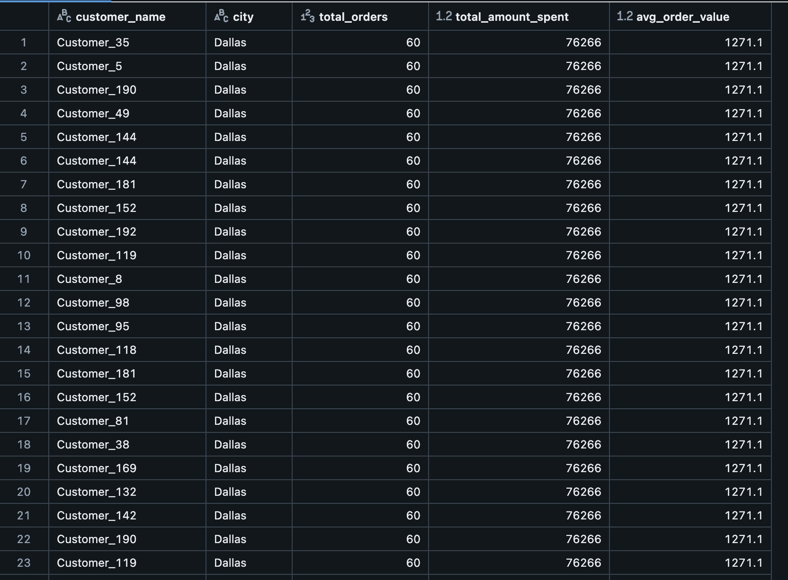

### Explanation of the Complex SQL Query

1. **`WITH city_totals AS (...)`**:
   - This Common Table Expression (CTE) calculates the total number of orders (`total_orders`), the total amount spent (`total_amount_spent`), and the average order value (`avg_order_value`) for each city by joining the `customers` and `orders` tables.
   - It uses the `GROUP BY` clause to group the results by city, aggregating data such as the count of orders and sum/average of order amounts.

2. **`SELECT ... FROM default.customers c JOIN city_totals ct`**:
   - This part of the query selects customer details along with aggregated city data from the CTE `city_totals`.
   - It joins the `customers` table again with `city_totals` to get individual customer names along with the aggregated values (total orders, total amount spent, and average order value per city).

3. **`ORDER BY ct.total_amount_spent DESC`**:
   - The results are ordered by the total amount spent per city in descending order. This way, cities where customers spent the most are shown at the top.

### Expected Results

The query will output a table that contains:
- **Customer Name**: The name of each customer.
- **City**: The city associated with each customer.
- **Total Orders**: The total number of orders placed in that city.
- **Total Amount Spent**: The total revenue generated from that city based on the orders.
- **Average Order Value**: The average value of an order placed in that city.

The results will be sorted by the total amount spent per city, showing the cities with the highest revenue first. This can be useful for identifying the most profitable regions and understanding customer distribution and spending patterns per city.

### Result
